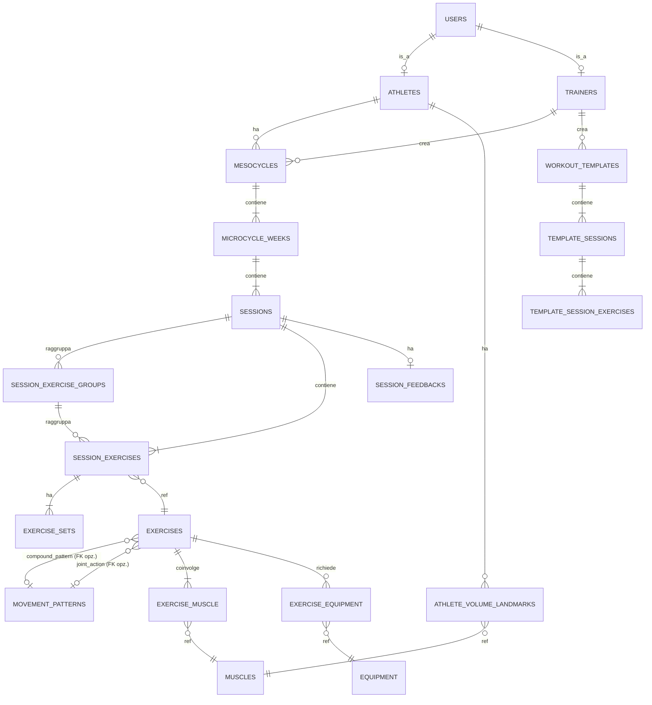

# iron-gym · Step 0 · Discovery e modello di dominio

> **Stato:** draft v0.3
> **Database target:** `iron_gym` (MySQL 8)
> **Scope:** definizione del dominio bodybuilding e del modello dati training-core. Non è in scope di questo step il gestionale palestra (abbonamenti, accessi, pagamenti), l'app atleta e le UI: si parte da quelli negli step successivi avendo già il cuore del dominio stabilizzato.
> **Changelog v0.1 → v0.2:**
> - Introdotta tabella di lookup `movement_patterns` al posto dell'ENUM `movement_pattern` sulla tabella `exercises`. Motivazione: i pattern motori sono una tassonomia aperta che cresce in funzione del catalogo esercizi, e tenerli in ENUM richiede una migration ogni volta che vogliamo affinarli. Le altre tassonomie con valori stabili e chiusi (`mechanic`, `plane`, `laterality`, `skill_level`, `measurement_type`, ecc.) restano ENUM.
> - Aggiunta colonna `category` su `movement_patterns` per distinguere `compound_pattern` (squat, hinge, horizontal_push) da `joint_action` (elbow_flexion, shoulder_abduction). Permette filtri più ricchi nel workout builder.
>
> **Changelog v0.2 → v0.3:**
> - La FK unica `movement_pattern_id` su `exercises` viene splittata in due FK separate `compound_pattern_id` e `joint_action_id`, entrambe nullable. Motivazione: un esercizio è classificato lungo uno dei due assi tassonomici, non entrambi; tenerli in colonne separate rende le query più espressive (`WHERE joint_action_id IS NOT NULL` filtra tutti gli isolation classificati per azione articolare) e permette CHECK constraint XOR a livello DB. Le query che prima facevano JOIN sul `category` ora fanno JOIN diretto sulla colonna giusta.
> - Rimosso il pattern generico `isolation` dai compound_pattern: era un fallback non più utilizzato dopo l'introduzione della tassonomia per joint action. Il valore `isolation` rimane solo su `mechanic` (ENUM compound/isolation), dove ha significato semantico distinto (caratterizza il numero di articolazioni coinvolte).
> - Estesa la tassonomia joint_action con 7 nuovi pattern necessari a coprire l'intero catalogo seed: `shoulder_horizontal_adduction` (croci, pec deck), `shoulder_extension` (pullover, straight arm pulldown), `hip_extension` (hyperextension), `hip_abduction` (abduzioni glutei), `hip_adduction` (adductor machine), `knee_extension` (leg extension, sissy squat), `knee_flexion` (leg curl).
> - Aggiunto `ab_wheel` alla lookup equipment per supportare `ab_wheel_rollout`.

---

## 1. Scope e obiettivi dello Step 0

Lo Step 0 produce le fondamenta su cui ogni feature successiva poggerà. Sbagliare qui significa rifare migrazioni dolorose tra sei mesi, quindi vale la pena spendere tempo. Gli obiettivi concreti sono quattro: definire un glossario condiviso del dominio bodybuilding così che dev, trainer e gestore parlino la stessa lingua; mappare le personas e il loro accesso al sistema; modellare la gerarchia di periodizzazione fino al singolo set, includendo prescrizione, esecuzione e feedback; rappresentare correttamente tutte le tecniche speciali richieste senza dover stravolgere lo schema in seguito. L'output finale è un ERD, uno schema SQL preliminare delle tabelle training-core e un set di regole di progressione che alimenteranno il motore di autoregolazione dello Step 4.

Volutamente fuori scope in questo step: macrocicli annuali (decisione di progetto), peaking per gare, gestione cardio/conditioning come dominio separato (lo trattiamo come "esercizio time-based" all'interno dello stesso modello), nutrizione e supplementazione.

---

## 2. Glossario del dominio

Il glossario è la cosa più sottovalutata di un progetto di dominio. Lo metto in tabella per riferimento rapido durante lo sviluppo.

| Termine | Definizione operativa nel sistema |
|---|---|
| **Set** | Una singola serie di ripetizioni eseguite senza interruzione significativa. È l'unità atomica di lavoro. |
| **Rep** | Ripetizione, ciclo completo di un movimento. |
| **Working set** | Set che conta ai fini del volume di allenamento. |
| **Warm-up set** | Set di riscaldamento, non conta per il volume settimanale né per i landmarks. |
| **1RM** | One Repetition Maximum, carico massimo sollevabile per una ripetizione singola. |
| **e1RM** | Estimated 1RM, calcolato dal sistema da set submassimali. Formula primaria: **Epley** `1RM = w * (1 + r/30)`. Alternative selezionabili: **Brzycki** e **Lombardi**. |
| **RPE** | Rate of Perceived Exertion, scala 1-10 dello sforzo percepito. Il trainer prescrive un target, l'atleta lo riporta. |
| **RIR** | Reps in Reserve, numero di ripetizioni residue prima del cedimento. Conversione approssimata: `RIR = 10 - RPE`. Nel modello dati teniamo entrambi i campi ma uno è derivabile dall'altro. |
| **Volume** | Due accezioni distinte: **tonnellaggio** `sets x reps x weight` (kg sollevati) e **hard sets per muscolo per settimana** (set effettivi vicini al cedimento). Il secondo è quello usato per il programma. |
| **MEV** | Minimum Effective Volume. Soglia minima di hard set settimanali per muscolo sotto la quale non c'è stimolo ipertrofico significativo. |
| **MAV** | Maximum Adaptive Volume. Range di volume in cui si ottengono i migliori adattamenti. |
| **MRV** | Maximum Recoverable Volume. Soglia massima oltre la quale si entra in over-reaching e si compromette il recupero. |
| **Mesocycle** | Ciclo di allenamento di 4-6 settimane con una progressione coerente. Unità massima di programmazione nel sistema. |
| **Microcycle** | Singola settimana all'interno del mesociclo. |
| **Session** | Singola sessione di allenamento (giorno), appartiene a un microciclo. |
| **Deload** | Settimana di scarico programmata, tipicamente l'ultima del mesociclo: volume ridotto del ~50% e intensità del ~10%. |
| **Autoregulation** | Aggiustamento dei parametri prescritti sulla base del feedback dell'atleta (fatica, dolori articolari, performance). |
| **Tempo** | Cadenza del movimento espressa come `eccentrica-pausa_bassa-concentrica-pausa_alta` (es. `3-1-1-0`). |
| **Drop set** | Set portato a cedimento seguito da scarico di peso e immediata continuazione, ripetibile più volte. |
| **Rest-pause** | Set principale seguito da brevi pause (10-20s) e ripartenze fino a esaurimento residuo. |
| **Myo-reps** | Variante di rest-pause con set di attivazione + cluster di mini-set a basso volume e alta intensità neurale. |
| **Cluster set** | Set frammentato in mini-blocchi (es. 6 reps = 2+2+2 con 15s di pausa tra blocchi). |
| **Superset / Giant set** | 2 (o 3+) esercizi eseguiti in sequenza senza recupero tra loro. |
| **Pre-exhaustion** | Tecnica di ordinamento (isolazione prima del composto), non richiede dati strutturali specifici. |
| **21s** | Set unico composto da 7 reps in mezza escursione bassa + 7 in mezza escursione alta + 7 full ROM. |
| **EMOM / AMRAP** | Strutture time-based, presenti per completezza anche se il focus è BB. |

---

## 3. Personas

Quattro tipi di utente, con privilegi diversi.

**Atleta** è il tesserato che si allena. Accede via PWA, vede esclusivamente le sue schede, esegue il workout loggando peso, reps e RIR, registra il feedback post-sessione, consulta lo storico e i grafici dei suoi progressi. Non vede schede di altri atleti né template di sistema non assegnati.

**Trainer** è il personal trainer. Accede via backoffice Laravel + Livewire. Crea e modifica template, costruisce mesocicli, li assegna agli atleti (uno o più, in funzione dell'organizzazione della palestra), monitora i feedback e applica autoregolazione manuale o accetta i suggerimenti automatici del sistema. Dato che il catalogo template è gym-wide, ogni trainer vede tutti i template di tutti i colleghi e può prenderli come base; il sistema traccia chi ha creato cosa per fini di audit ma non blocca l'accesso.

**Gestore** è il proprietario o direttore tecnico. Ha tutti i privilegi dei trainer più la visione completa sui KPI (retention, occupancy, fatturato), accesso ai dati finanziari, gestione staff e listini. Negli step successivi avrà anche reportistica fiscale.

**Receptionist** è il front-desk. Gestisce check-in, anagrafica tesserati, certificati medici, vendita abbonamenti e ingressi. Non accede al dominio training se non in sola lettura per consultazione veloce.

---

## 4. Tassonomia degli esercizi

La tassonomia è la base del catalogo. Ogni esercizio è classificato lungo più assi indipendenti.

| Asse | Tipo | Valori |
|---|---|---|
| **Movement pattern** | **Tabella di lookup `movement_patterns`** | Vedi sezione dedicata sotto |
| **Mechanic** | ENUM | compound, isolation |
| **Equipment** | Tabella di lookup `equipment` | barbell, dumbbell, cable, machine, smith_machine, bodyweight, kettlebell, band, plate_loaded, bench, pull_up_bar, dip_bar, hyperextension, ab_wheel |
| **Plane of motion** | ENUM | sagittal, frontal, transverse, multiplanar |
| **Laterality** | ENUM | bilateral, unilateral_alternating, unilateral_isolated |
| **Skill level** | ENUM | beginner, intermediate, advanced |
| **Measurement type** | ENUM | reps_weight, reps_only, time, time_weight, distance, isometric_hold |

### Movement patterns

I pattern sono divisi in due categorie tassonomiche complementari, distinte dalla colonna `category` della tabella:

**`compound_pattern`** — pattern motori "globali" che descrivono un movimento di tutto il corpo o di un'intera catena cinetica. Sono i tradizionali pattern usati nel coaching funzionale. Vengono associati prevalentemente a esercizi compound.

| slug | name_it |
|---|---|
| `squat` | Squat |
| `hinge` | Hinge (cerniera dell'anca) |
| `lunge` | Affondo |
| `horizontal_push` | Spinta orizzontale |
| `vertical_push` | Spinta verticale |
| `horizontal_pull` | Trazione orizzontale |
| `vertical_pull` | Trazione verticale |
| `carry` | Trasporto |
| `rotation` | Rotazione |
| `anti_rotation` | Anti-rotazione |
| `plyometric` | Pliometrico |
| `locomotion` | Locomozione |

**`joint_action`** — pattern definiti a livello di singola articolazione e direzione del movimento. Servono a classificare in modo preciso gli esercizi di isolamento, dove il pattern globale "isolation" sarebbe troppo grossolano.

| slug | name_it |
|---|---|
| `shoulder_abduction` | Abduzione di spalla |
| `shoulder_horizontal_abduction` | Abduzione orizzontale di spalla |
| `shoulder_horizontal_adduction` | Adduzione orizzontale di spalla |
| `shoulder_extension` | Estensione di spalla |
| `elbow_flexion` | Flessione di gomito |
| `elbow_extension` | Estensione di gomito |
| `scapular_elevation` | Elevazione scapolare |
| `ankle_plantarflexion` | Flessione plantare di caviglia |
| `spinal_flexion` | Flessione del rachide |
| `hip_flexion` | Flessione d'anca |
| `hip_extension` | Estensione d'anca |
| `hip_abduction` | Abduzione d'anca |
| `hip_adduction` | Adduzione d'anca |
| `knee_extension` | Estensione di ginocchio |
| `knee_flexion` | Flessione di ginocchio |

Totale iniziale: 27 pattern (12 compound + 15 joint action). La tabella è progettata per crescere: aggiungere `wrist_flexion`, `cervical_rotation`, ecc. sarà una semplice INSERT, senza migration.

### Anatomia muscolare

Il **coinvolgimento muscolare** è una relazione N a M, perché ogni esercizio attiva più muscoli con ruoli diversi. Ogni associazione esercizio-muscolo ha un `role` enum (`primary`, `secondary`, `stabilizer`) e un `contribution_pct` opzionale (0-100) che permette di attribuire correttamente il volume al muscolo target nel calcolo settimanale: un curl con manubrio contribuisce 100% al bicipite brachiale; una panca piana contribuisce ~70% al gran pettorale, ~20% al tricipite e ~10% al deltoide anteriore. Questi pesi sono configurabili e useremo i valori standard della letteratura come default, ma la palestra può rifinirli.

L'elenco dei muscoli che useremo come anagrafica di partenza (modificabile dal gestore) è il classico: gran pettorale (clavicolare/sternale), deltoide (anteriore/laterale/posteriore), tricipite, bicipite, brachiale, brachioradiale, avambraccio, gran dorsale, trapezio (superiore/medio/inferiore), romboidi, erettori spinali, quadricipite, ischiocrurali, gluteo (massimo/medio), adduttori, polpacci (gastrocnemio/soleo), addome (retto/obliqui/trasverso). Una ventina abbondante di voci, basta. La granularità maggiore (es. capo lungo vs capo breve del tricipite) la teniamo come `muscle_head` opzionale per chi vuole spingersi più in dettaglio nelle schede agonistiche.

---

## 5. Modello concettuale della periodizzazione

La gerarchia è lineare e annidata: **Mesocycle → MicrocycleWeek → Session → SessionExerciseGroup → SessionExercise → Set**. Ogni livello aggiunge informazione senza duplicare.

Un **Mesocycle** appartiene a un atleta, è creato da un trainer, dura 4-6 settimane (configurabile, default 5), ha un obiettivo principale (`hypertrophy`, `strength`, `cut`, `recomp`, `peaking`), un modello di periodizzazione (`linear`, `undulating_dup`, `block`), e una data di inizio. Da queste informazioni il sistema genera automaticamente le `n` settimane corrispondenti, marcando l'ultima come `is_deload = true` di default. Il trainer può poi modificare manualmente.

Una **MicrocycleWeek** ha un numero progressivo (1..n), il flag deload, ed è il contenitore delle sessioni di quella settimana. Non ha contenuto proprio se non quello che le vive dentro: serve come pivot temporale per i calcoli di volume settimanale per muscolo.

Una **Session** ha un nome libero (es. "Push A", "Gambe pesante"), un ordine all'interno della settimana, una data programmata, uno status (`planned`, `in_progress`, `completed`, `skipped`), eventualmente una data di esecuzione effettiva (può non coincidere con quella programmata se l'atleta sposta l'allenamento).

Uno **SessionExerciseGroup** serve a raggruppare esercizi che vanno eseguiti insieme: superset (2 esercizi), giant set (3+ esercizi), o circuit (configurabile). Ha un `group_type` enum, un numero di round prescritti, un ordine all'interno della sessione, eventuali parametri di riposo tra round. Se un esercizio è "normale" (straight set), non appartiene a nessun gruppo: in tal caso il `group_id` su `SessionExercise` è NULL.

Un **SessionExercise** lega un esercizio del catalogo a una sessione (o a un gruppo). Ha un ordine, un `technique_type` enum (`straight`, `drop_set`, `rest_pause`, `myo_reps`, `cluster`, `twenty_ones`, `pre_exhaustion`, `emom`, `amrap`), un tempo prescritto (`varchar(7)` es. `3-1-1-0`), riposo tra serie in secondi, note del trainer. È il punto in cui "questo esercizio in questa sessione" diventa un'entità prescrittiva.

Un **Set** è l'unità atomica. Distinguiamo prescrizione ed esecuzione sullo stesso record (modello single-table, più semplice da scrivere e leggere rispetto a due tabelle separate): `planned_reps`, `planned_weight`, `planned_rir`, e in parallelo `actual_reps`, `actual_weight`, `actual_rir`, `actual_rpe`, `completed_at`. Il flag `is_warmup` esclude il set dai calcoli di volume. Per esercizi unilaterali si registra un singolo Set per coppia di lati (assunzione confermata): chi vuole tracciare squilibri lato-destro/lato-sinistro lo farà nelle note libere o in uno step futuro.

Per gestire le **tecniche complesse** che generano più "sotto-set" logici (drop set, rest-pause, myo-reps, cluster, 21s), introduciamo `set_sequence_id` e `sequence_index` sulla tabella `exercise_sets`. Tutti i Set appartenenti alla stessa sequenza condividono il `set_sequence_id`; l'`sequence_index` ne stabilisce l'ordine. Un drop set diventa così tre Set con stesso `set_sequence_id`, `sequence_index = 0,1,2` e pesi decrescenti. Un 21s diventa tre Set con `set_subtype` distinto (`bottom_half`, `top_half`, `full_rom`). Questo design ha il vantaggio di mantenere ogni effort atomico calcolabile (volume, e1RM) senza JSON arbitrari.

---

## 6. Tecniche speciali: mappatura nel modello dati

Per chiarezza riporto come ognuna delle tecniche richieste si concretizza nel modello.

| Tecnica | SessionExercise.technique_type | Rappresentazione Set |
|---|---|---|
| **Straight set** | `straight` | N Set indipendenti, nessun `set_sequence_id` |
| **Superset** | `straight` (sul singolo esercizio) | I 2+ esercizi condividono `session_exercise_group_id`, group_type = `superset` |
| **Giant set** | come superset | come superset, group_type = `giant_set` |
| **Drop set** | `drop_set` | Set in sequenza con stesso `set_sequence_id`, peso decrescente |
| **Rest-pause** | `rest_pause` | Set in sequenza: 1 "main" + N "rest_pause_burst" |
| **Myo-reps** | `myo_reps` | 1 "activation" + N "cluster" con basse reps |
| **Cluster set** | `cluster` | Set in sequenza con `intra_cluster_rest_sec` valorizzato |
| **Pre-exhaustion** | `pre_exhaustion` | Nessuna struttura speciale, solo flag e ordine. Convenzione: SessionExercise con questo type viene prima dell'esercizio composto |
| **21s** | `twenty_ones` | 3 Set in sequenza con `set_subtype` (`bottom_half`, `top_half`, `full_rom`) |
| **EMOM** | `emom` | Set indipendenti con `duration_sec` per minuto |
| **AMRAP** | `amrap` | 1 Set con `duration_sec` e `actual_reps` totali |

Tutte le tecniche convivono nello stesso schema senza tabelle dedicate: un singolo enum + una sequenza opzionale coprono il dominio.

---

## 7. Regole di progressione e autoregolazione

Questa è la parte algoritmica, la rifiniremo nello Step 4 ma definiamo qui le regole base perché lo schema deve supportarle.

Ogni atleta ha **volume landmarks** personalizzati per muscolo, memorizzati nella tabella `athlete_volume_landmarks`: `mev`, `mav_min`, `mav_max`, `mrv`, espressi in hard sets settimanali. I valori di default vengono dalla letteratura (es. pettorali MEV ~8, MAV 12-20, MRV 22; bicipiti MEV ~6, MAV 10-16, MRV 20) ma il trainer li sovrascrive in funzione dell'esperienza e della risposta individuale dell'atleta.

La **progressione settimanale** standard parte da MEV in settimana 1, aggiunge un set per muscolo per settimana (set per muscolo, non set per esercizio: il sistema distribuisce i set aggiunti in funzione dei `contribution_pct`), fino a raggiungere MRV o l'ultima settimana del mesociclo. La settimana di deload riduce il numero di set di circa il 50% e il carico del 10%.

Il **feedback post-sessione** è l'input dell'autoregolazione. Dopo ogni sessione l'atleta valuta cinque metriche su scala 0-3 (semplifichiamo la scala 0-3 di RP per ridurre la fatica di compilazione): pump muscolare, soreness residua dal precedente, perceived effort, joint pain, performance percepita. Il sistema aggrega questi segnali a livello settimanale per muscolo: se due o più segnali peggiorano rispetto alla settimana precedente, blocca l'aggiunta di set; se tre o più peggiorano, riduce il volume e suggerisce un deload anticipato. Le soglie esatte sono configurabili.

I **trigger di deload** sono: raggiungimento MRV per uno o più gruppi muscolari principali, joint pain persistente ≥ 2 per due settimane consecutive su uno stesso esercizio, RIR drift (l'atleta non riesce a mantenere il RIR target prescritto su esercizi indicatori), fine programmata del mesociclo.

---

## 8. ERD

Diagramma delle entità training-core. Tabelle del gestionale (anagrafica, abbonamenti, pagamenti, certificati) verranno aggiunte nello Step 1 e non sono qui rappresentate per non sporcare la vista del dominio training.



Note di lettura: `WORKOUT_TEMPLATES` è la versione "stampo" che il trainer costruisce una volta e instanzia in un Mesocycle quando assegna a un atleta. Il template è gym-wide (visibile a tutti i trainer) ma traccia il creatore. L'istanziamento copia la struttura in `sessions`/`session_exercises` rendendole indipendenti dal template: modifiche successive al template non si propagano alle assegnazioni già attive. La doppia FK opzionale `EXERCISES → MOVEMENT_PATTERNS` rappresenta le due colonne `compound_pattern_id` e `joint_action_id`: esattamente una delle due è valorizzata in ogni record di `exercises` (vincolo CHECK XOR a livello DB).

---

## 9. Schema SQL preliminare

Solo le tabelle training-core. SQL MySQL 8, motore InnoDB, charset `utf8mb4_unicode_ci`. Convenzioni: nomi tabelle plurali snake_case, FK con suffisso `_id`, timestamp `created_at`/`updated_at` su tutte le tabelle non puramente di lookup, soft delete (`deleted_at`) solo dove ha senso conservare lo storico.

```sql
-- Anagrafica pattern motori (lookup gestita dal gestore)
CREATE TABLE movement_patterns (
    id INT UNSIGNED AUTO_INCREMENT PRIMARY KEY,
    slug VARCHAR(64) NOT NULL UNIQUE,                  -- es. "horizontal_push", "elbow_flexion"
    name_it VARCHAR(128) NOT NULL,
    category ENUM('compound_pattern','joint_action') NOT NULL,
    display_order SMALLINT UNSIGNED DEFAULT 0,
    INDEX idx_category (category)
) ENGINE=InnoDB;

-- Anagrafica muscoli (lookup gestita dal gestore)
CREATE TABLE muscles (
    id INT UNSIGNED AUTO_INCREMENT PRIMARY KEY,
    slug VARCHAR(64) NOT NULL UNIQUE,                  -- es. "pectoralis_major"
    name_it VARCHAR(128) NOT NULL,                     -- es. "Gran pettorale"
    muscle_group VARCHAR(64) NOT NULL,                 -- es. "chest", "back", "legs"
    muscle_head VARCHAR(64) NULL,                      -- es. "clavicular", "sternal" (opzionale)
    display_order SMALLINT UNSIGNED DEFAULT 0
) ENGINE=InnoDB;

-- Anagrafica attrezzature
CREATE TABLE equipment (
    id INT UNSIGNED AUTO_INCREMENT PRIMARY KEY,
    slug VARCHAR(64) NOT NULL UNIQUE,
    name_it VARCHAR(128) NOT NULL
) ENGINE=InnoDB;

-- Catalogo esercizi gym-wide
CREATE TABLE exercises (
    id INT UNSIGNED AUTO_INCREMENT PRIMARY KEY,
    slug VARCHAR(128) NOT NULL UNIQUE,
    name_it VARCHAR(255) NOT NULL,
    description TEXT NULL,
    compound_pattern_id INT UNSIGNED NULL,             -- FK movement_patterns (category='compound_pattern')
    joint_action_id INT UNSIGNED NULL,                 -- FK movement_patterns (category='joint_action')
    mechanic ENUM('compound','isolation') NOT NULL,
    plane ENUM('sagittal','frontal','transverse','multiplanar') NOT NULL DEFAULT 'sagittal',
    laterality ENUM('bilateral','unilateral_alternating','unilateral_isolated') NOT NULL DEFAULT 'bilateral',
    skill_level ENUM('beginner','intermediate','advanced') NOT NULL DEFAULT 'intermediate',
    measurement_type ENUM(
        'reps_weight','reps_only','time','time_weight','distance','isometric_hold'
    ) NOT NULL DEFAULT 'reps_weight',
    video_url VARCHAR(512) NULL,                       -- riferimento storage (S3/MinIO)
    thumbnail_url VARCHAR(512) NULL,
    created_by INT UNSIGNED NULL,                      -- FK users (trainer creator)
    created_at TIMESTAMP NULL DEFAULT CURRENT_TIMESTAMP,
    updated_at TIMESTAMP NULL DEFAULT CURRENT_TIMESTAMP ON UPDATE CURRENT_TIMESTAMP,
    deleted_at TIMESTAMP NULL,
    INDEX idx_compound_pattern (compound_pattern_id),
    INDEX idx_joint_action (joint_action_id),
    INDEX idx_mechanic (mechanic),
    FOREIGN KEY (compound_pattern_id) REFERENCES movement_patterns(id) ON DELETE RESTRICT,
    FOREIGN KEY (joint_action_id) REFERENCES movement_patterns(id) ON DELETE RESTRICT,
    -- Vincolo XOR: esattamente uno dei due pattern deve essere valorizzato.
    -- MySQL 8.0.16+ supporta CHECK constraint enforced. La validazione è duplicata
    -- anche a livello applicativo (Form Request) per intercettare errori prima del DB.
    CONSTRAINT chk_pattern_xor CHECK (
        (compound_pattern_id IS NOT NULL AND joint_action_id IS NULL)
        OR (compound_pattern_id IS NULL AND joint_action_id IS NOT NULL)
    )
) ENGINE=InnoDB;

-- Pivot esercizio-muscolo (con ruolo e contributo)
CREATE TABLE exercise_muscle (
    exercise_id INT UNSIGNED NOT NULL,
    muscle_id INT UNSIGNED NOT NULL,
    role ENUM('primary','secondary','stabilizer') NOT NULL,
    contribution_pct TINYINT UNSIGNED NOT NULL DEFAULT 100,  -- 0..100, default 100 per primary di isolamento
    PRIMARY KEY (exercise_id, muscle_id),
    FOREIGN KEY (exercise_id) REFERENCES exercises(id) ON DELETE CASCADE,
    FOREIGN KEY (muscle_id) REFERENCES muscles(id) ON DELETE RESTRICT
) ENGINE=InnoDB;

-- Pivot esercizio-attrezzatura
CREATE TABLE exercise_equipment (
    exercise_id INT UNSIGNED NOT NULL,
    equipment_id INT UNSIGNED NOT NULL,
    PRIMARY KEY (exercise_id, equipment_id),
    FOREIGN KEY (exercise_id) REFERENCES exercises(id) ON DELETE CASCADE,
    FOREIGN KEY (equipment_id) REFERENCES equipment(id) ON DELETE RESTRICT
) ENGINE=InnoDB;

-- Volume landmarks personalizzati per atleta-muscolo
CREATE TABLE athlete_volume_landmarks (
    id INT UNSIGNED AUTO_INCREMENT PRIMARY KEY,
    athlete_id INT UNSIGNED NOT NULL,                  -- FK users (athletes view)
    muscle_id INT UNSIGNED NOT NULL,
    mev TINYINT UNSIGNED NOT NULL,                     -- set settimanali minimi
    mav_min TINYINT UNSIGNED NOT NULL,
    mav_max TINYINT UNSIGNED NOT NULL,
    mrv TINYINT UNSIGNED NOT NULL,
    notes TEXT NULL,
    updated_by INT UNSIGNED NULL,                      -- trainer che ha modificato
    created_at TIMESTAMP NULL DEFAULT CURRENT_TIMESTAMP,
    updated_at TIMESTAMP NULL DEFAULT CURRENT_TIMESTAMP ON UPDATE CURRENT_TIMESTAMP,
    UNIQUE KEY uq_athlete_muscle (athlete_id, muscle_id),
    FOREIGN KEY (muscle_id) REFERENCES muscles(id) ON DELETE RESTRICT
) ENGINE=InnoDB;

-- Template di scheda riutilizzabili (gym-wide)
CREATE TABLE workout_templates (
    id INT UNSIGNED AUTO_INCREMENT PRIMARY KEY,
    name VARCHAR(255) NOT NULL,
    description TEXT NULL,
    goal ENUM('hypertrophy','strength','cut','recomp','peaking','general') NOT NULL DEFAULT 'hypertrophy',
    periodization_model ENUM('linear','undulating_dup','block') NOT NULL DEFAULT 'linear',
    weeks_count TINYINT UNSIGNED NOT NULL DEFAULT 5,
    days_per_week TINYINT UNSIGNED NOT NULL DEFAULT 4,
    created_by INT UNSIGNED NOT NULL,                  -- FK users (trainer)
    is_active TINYINT(1) NOT NULL DEFAULT 1,
    created_at TIMESTAMP NULL DEFAULT CURRENT_TIMESTAMP,
    updated_at TIMESTAMP NULL DEFAULT CURRENT_TIMESTAMP ON UPDATE CURRENT_TIMESTAMP,
    deleted_at TIMESTAMP NULL
) ENGINE=InnoDB;

-- Mesociclo: istanza concreta assegnata a un atleta
CREATE TABLE mesocycles (
    id INT UNSIGNED AUTO_INCREMENT PRIMARY KEY,
    athlete_id INT UNSIGNED NOT NULL,                  -- FK users
    trainer_id INT UNSIGNED NOT NULL,                  -- FK users (trainer che ha creato/assegnato)
    template_id INT UNSIGNED NULL,                     -- FK workout_templates (opzionale, può essere da zero)
    name VARCHAR(255) NOT NULL,                        -- es. "Massa Q1 2026"
    goal ENUM('hypertrophy','strength','cut','recomp','peaking','general') NOT NULL DEFAULT 'hypertrophy',
    periodization_model ENUM('linear','undulating_dup','block') NOT NULL DEFAULT 'linear',
    start_date DATE NOT NULL,
    weeks_count TINYINT UNSIGNED NOT NULL DEFAULT 5,
    status ENUM('draft','active','completed','aborted') NOT NULL DEFAULT 'draft',
    notes TEXT NULL,
    created_at TIMESTAMP NULL DEFAULT CURRENT_TIMESTAMP,
    updated_at TIMESTAMP NULL DEFAULT CURRENT_TIMESTAMP ON UPDATE CURRENT_TIMESTAMP,
    deleted_at TIMESTAMP NULL,
    INDEX idx_athlete (athlete_id),
    INDEX idx_status (status),
    FOREIGN KEY (template_id) REFERENCES workout_templates(id) ON DELETE SET NULL
) ENGINE=InnoDB;

-- Settimane del mesociclo
CREATE TABLE microcycle_weeks (
    id INT UNSIGNED AUTO_INCREMENT PRIMARY KEY,
    mesocycle_id INT UNSIGNED NOT NULL,
    week_number TINYINT UNSIGNED NOT NULL,             -- 1..weeks_count
    is_deload TINYINT(1) NOT NULL DEFAULT 0,
    start_date DATE NOT NULL,
    end_date DATE NOT NULL,
    UNIQUE KEY uq_meso_week (mesocycle_id, week_number),
    FOREIGN KEY (mesocycle_id) REFERENCES mesocycles(id) ON DELETE CASCADE
) ENGINE=InnoDB;

-- Sessione (giorno di allenamento)
CREATE TABLE sessions (
    id INT UNSIGNED AUTO_INCREMENT PRIMARY KEY,
    microcycle_week_id INT UNSIGNED NOT NULL,
    name VARCHAR(128) NOT NULL,                        -- "Push A", "Gambe pesante"
    order_in_week TINYINT UNSIGNED NOT NULL,
    scheduled_date DATE NULL,
    started_at TIMESTAMP NULL,
    completed_at TIMESTAMP NULL,
    status ENUM('planned','in_progress','completed','skipped') NOT NULL DEFAULT 'planned',
    athlete_notes TEXT NULL,                           -- note dell'atleta a fine sessione
    trainer_notes TEXT NULL,                           -- note del trainer
    created_at TIMESTAMP NULL DEFAULT CURRENT_TIMESTAMP,
    updated_at TIMESTAMP NULL DEFAULT CURRENT_TIMESTAMP ON UPDATE CURRENT_TIMESTAMP,
    INDEX idx_status (status),
    INDEX idx_scheduled (scheduled_date),
    FOREIGN KEY (microcycle_week_id) REFERENCES microcycle_weeks(id) ON DELETE CASCADE
) ENGINE=InnoDB;

-- Gruppo di esercizi (superset, giant set, circuit)
CREATE TABLE session_exercise_groups (
    id INT UNSIGNED AUTO_INCREMENT PRIMARY KEY,
    session_id INT UNSIGNED NOT NULL,
    group_type ENUM('superset','giant_set','circuit') NOT NULL,
    order_in_session SMALLINT UNSIGNED NOT NULL,
    rounds TINYINT UNSIGNED NOT NULL DEFAULT 3,        -- numero di giri prescritti
    rest_between_rounds_sec SMALLINT UNSIGNED NULL,
    FOREIGN KEY (session_id) REFERENCES sessions(id) ON DELETE CASCADE
) ENGINE=InnoDB;

-- Esercizio in sessione
CREATE TABLE session_exercises (
    id INT UNSIGNED AUTO_INCREMENT PRIMARY KEY,
    session_id INT UNSIGNED NOT NULL,
    group_id INT UNSIGNED NULL,                        -- NULL se straight set isolato
    exercise_id INT UNSIGNED NOT NULL,
    order_in_session SMALLINT UNSIGNED NOT NULL,       -- ordine globale nella sessione
    order_in_group TINYINT UNSIGNED NULL,              -- ordine dentro il gruppo (se applicabile)
    technique_type ENUM(
        'straight','drop_set','rest_pause','myo_reps','cluster',
        'twenty_ones','pre_exhaustion','emom','amrap'
    ) NOT NULL DEFAULT 'straight',
    tempo VARCHAR(7) NULL,                             -- es. "3-1-1-0"
    planned_sets_count TINYINT UNSIGNED NOT NULL,      -- quanti set prescritti
    planned_rest_sec SMALLINT UNSIGNED NULL,           -- riposo tra set in secondi
    intra_cluster_rest_sec TINYINT UNSIGNED NULL,      -- per cluster set
    trainer_note TEXT NULL,
    INDEX idx_session_order (session_id, order_in_session),
    FOREIGN KEY (session_id) REFERENCES sessions(id) ON DELETE CASCADE,
    FOREIGN KEY (group_id) REFERENCES session_exercise_groups(id) ON DELETE SET NULL,
    FOREIGN KEY (exercise_id) REFERENCES exercises(id) ON DELETE RESTRICT
) ENGINE=InnoDB;

-- Set: unità atomica con prescrizione + esecuzione
CREATE TABLE exercise_sets (
    id INT UNSIGNED AUTO_INCREMENT PRIMARY KEY,
    session_exercise_id INT UNSIGNED NOT NULL,
    set_index TINYINT UNSIGNED NOT NULL,               -- 1..N nella SessionExercise
    set_sequence_id INT UNSIGNED NULL,                 -- raggruppa i sub-set di drop/rest-pause/myo/cluster/21s
    sequence_index TINYINT UNSIGNED NULL,              -- ordine dentro la sequenza
    set_subtype VARCHAR(32) NULL,                      -- es. "bottom_half","top_half","full_rom","activation","cluster","drop_1"
    is_warmup TINYINT(1) NOT NULL DEFAULT 0,

    -- prescrizione (planned)
    planned_reps SMALLINT UNSIGNED NULL,               -- NULL per AMRAP
    planned_weight_kg DECIMAL(6,2) NULL,
    planned_rir TINYINT UNSIGNED NULL,                 -- 0..10
    planned_rpe DECIMAL(3,1) NULL,                     -- 1.0..10.0 (alternativa a RIR)
    planned_duration_sec SMALLINT UNSIGNED NULL,       -- per EMOM/AMRAP/isometric

    -- esecuzione (actual)
    actual_reps SMALLINT UNSIGNED NULL,
    actual_weight_kg DECIMAL(6,2) NULL,
    actual_rir TINYINT UNSIGNED NULL,
    actual_rpe DECIMAL(3,1) NULL,
    actual_duration_sec SMALLINT UNSIGNED NULL,
    completed_at TIMESTAMP NULL,
    note TEXT NULL,

    INDEX idx_session_exercise (session_exercise_id),
    INDEX idx_sequence (set_sequence_id, sequence_index),
    FOREIGN KEY (session_exercise_id) REFERENCES session_exercises(id) ON DELETE CASCADE
) ENGINE=InnoDB;

-- Feedback aggregato post-sessione (scala 0-3)
CREATE TABLE session_feedbacks (
    id INT UNSIGNED AUTO_INCREMENT PRIMARY KEY,
    session_id INT UNSIGNED NOT NULL UNIQUE,
    pump TINYINT UNSIGNED NULL,                        -- 0..3
    soreness_prev TINYINT UNSIGNED NULL,               -- residua dalla sessione precedente
    perceived_effort TINYINT UNSIGNED NULL,
    joint_pain TINYINT UNSIGNED NULL,
    performance TINYINT UNSIGNED NULL,
    sleep_hours DECIMAL(3,1) NULL,                     -- bonus, utile correlare
    stress_level TINYINT UNSIGNED NULL,                -- 0..3
    note TEXT NULL,
    created_at TIMESTAMP NULL DEFAULT CURRENT_TIMESTAMP,
    FOREIGN KEY (session_id) REFERENCES sessions(id) ON DELETE CASCADE
) ENGINE=InnoDB;

-- Feedback specifico a livello di esercizio (opzionale, per joint pain mirato)
CREATE TABLE session_exercise_feedbacks (
    id INT UNSIGNED AUTO_INCREMENT PRIMARY KEY,
    session_exercise_id INT UNSIGNED NOT NULL UNIQUE,
    joint_pain TINYINT UNSIGNED NULL,                  -- 0..3 specifico per articolazione coinvolta
    pump TINYINT UNSIGNED NULL,
    note TEXT NULL,
    FOREIGN KEY (session_exercise_id) REFERENCES session_exercises(id) ON DELETE CASCADE
) ENGINE=InnoDB;

-- Template sessione (per workout_templates)
CREATE TABLE template_sessions (
    id INT UNSIGNED AUTO_INCREMENT PRIMARY KEY,
    template_id INT UNSIGNED NOT NULL,
    week_number TINYINT UNSIGNED NOT NULL,
    name VARCHAR(128) NOT NULL,
    order_in_week TINYINT UNSIGNED NOT NULL,
    FOREIGN KEY (template_id) REFERENCES workout_templates(id) ON DELETE CASCADE
) ENGINE=InnoDB;

-- Template esercizi (semplificato; in istanziamento si copia in session_exercises)
CREATE TABLE template_session_exercises (
    id INT UNSIGNED AUTO_INCREMENT PRIMARY KEY,
    template_session_id INT UNSIGNED NOT NULL,
    exercise_id INT UNSIGNED NOT NULL,
    order_in_session SMALLINT UNSIGNED NOT NULL,
    technique_type ENUM(
        'straight','drop_set','rest_pause','myo_reps','cluster',
        'twenty_ones','pre_exhaustion','emom','amrap'
    ) NOT NULL DEFAULT 'straight',
    tempo VARCHAR(7) NULL,
    planned_sets_count TINYINT UNSIGNED NOT NULL,
    planned_reps SMALLINT UNSIGNED NULL,
    planned_rir TINYINT UNSIGNED NULL,
    planned_rest_sec SMALLINT UNSIGNED NULL,
    note TEXT NULL,
    FOREIGN KEY (template_session_id) REFERENCES template_sessions(id) ON DELETE CASCADE,
    FOREIGN KEY (exercise_id) REFERENCES exercises(id) ON DELETE RESTRICT
) ENGINE=InnoDB;
```

Nota tecnica: gli FK verso `users` non li ho dichiarati esplicitamente perché la tabella `users` arriverà nello Step 1 col gestionale (Laravel default + estensioni per `athletes` e `trainers` come ruoli/profili separati). Li aggiungeremo come ALTER TABLE quando avremo definito la struttura utenti.

Ordine di creazione delle migration in Laravel (rilevante per le FK): prima `movement_patterns`, `muscles`, `equipment` (tutte lookup senza dipendenze); poi `exercises` (dipende da `movement_patterns`); poi i pivot `exercise_muscle` e `exercise_equipment`; infine il resto del dominio training.

---

## 10. Open questions e decisioni rimandate

Alcune cose le ho lasciate fuori volontariamente perché non bloccanti per lo Step 0 e meritano discussione dedicata.

**Versioning dei template.** Quando un trainer modifica un template già usato in mesocicli attivi, cosa succede? Decisione presa: il mesociclo è "snapshottato" all'istanziamento, modifiche al template non si propagano. Resta aperto: vogliamo un versioning esplicito dei template (v1, v2 ecc.) o basta la modifica in-place con audit log? Lo decidiamo nello Step 2.

**Tracciamento esercizi unilaterali granulare.** Per ora un Set = un effort per coppia di lati. Se in futuro vuoi tracciare squilibri (DX vs SX, utile in riabilitazione o post-infortunio) si aggiunge un campo `side ENUM('both','left','right')` senza rompere il modello.

**Calcolo e1RM su esercizi a corpo libero o assistiti.** Per trazioni assistite, dip a corpo libero ecc. servirà aggiungere `bodyweight_at_set_kg` su `exercise_sets`. Lo aggiungiamo quando avremo le misurazioni corporee dello Step 5 e potremo agganciare il peso corporeo della giornata.

**Cardio e conditioning.** Modellati come `measurement_type = 'time'` o `'distance'` sugli esercizi esistenti. Se diventano centrali (es. classi HIIT integrate) valuteremo un'entità dedicata, ma per ora non serve.

**Foto progressi e misurazioni corporee.** Sono Step 5, ma lo schema avrà un impatto trasversale (notifiche, dashboard atleta, confronti pose). Non lo tocchiamo qui.

**Multi-palestra.** Decisione presa: single-tenant, una sola palestra. Niente `gym_id` ovunque. Se in futuro il software venisse riproposto a un'altra palestra, sarà una nuova installazione con un nuovo DB.

**Soft delete su quali tabelle.** Per ora l'ho messo su `exercises`, `workout_templates`, `mesocycles`. Su `sessions` e tabelle figlie no: una sessione cancellata sparisce. Da rivedere se emerge un requisito di audit.

---

## Prossimi passi operativi

Una volta che hai validato questo documento, lo Step 1 può partire in parallelo su due binari: da una parte la struttura Laravel del progetto (skeleton, Docker compose, GitLab CI, AdminLTE integrato, autenticazione e ruoli), dall'altra le migrazioni per le tabelle qui descritte più seeding del catalogo esercizi e muscoli di base (vedi `exercises-catalog.md`).
